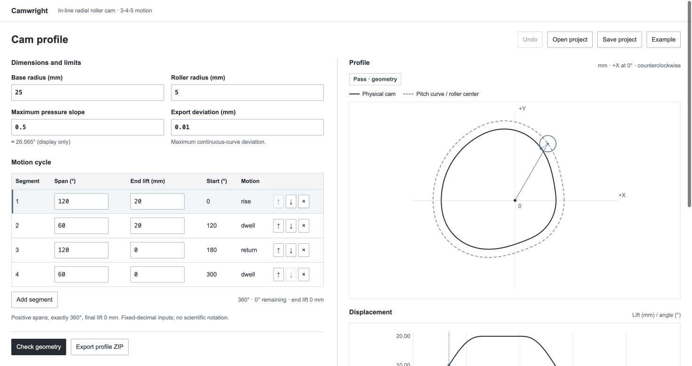

<p align="center"></p>

<h1 align="center">Camwright</h1>

<p align="center">Design an in-line roller cam, check its continuous geometry, and export the profile with bounded approximation error.</p>

<p align="center"><a href="#run-locally">Run locally</a> · <a href="https://github.com/nazeeh111/Camwright/releases/latest">Download latest release</a></p>



## Run locally

Runs locally with Python and its standard library. No account or network service is used.

From a source checkout, with Python 3.12 or newer:

```sh
python3 run.py
```

Open the printed `http://127.0.0.1:.../` URL if the browser does not open. Stop the local server with Ctrl+C. `python3 -m camwright --no-browser --port 8000` chooses an explicit port. The default chooses a free port.

To install locally:

```sh
python3 -m venv .venv
.venv/bin/python -m pip install .
.venv/bin/camwright
```

Installation builds a wheel using setuptools; running Camwright has no third-party Python dependencies. The source launcher needs no installation. Windows virtual environments use `Scripts` instead of `bin`.

Start with the bundled 20 mm example. Change the base radius from 25 mm to 20 mm and check again to see the pressure limit fail. Edit spans and ending lifts in the motion table. Cumulative angles and remaining degrees help close the cycle. Add, reorder, remove and undo segments. The displacement plot and profile share an angle cursor. Save the exact project strings to JSON and reopen it through the file chooser. Edits immediately mark prior results stale and disable inspection saving and export.

All dimensions are millimetres and spans are degrees. The axis passes through the cam center. Zero angle is +X, positive angles are counterclockwise, and +Y is upward. The physical cam is drawn solid; the dashed pitch curve follows the roller center. Its zero-lift radius is base plus roller radius. The physical surface is the inward normal offset by one roller radius.

Each segment uses the 3-4-5 polynomial `s(u)=s0+h(10u³−15u⁴+6u⁵)`. Displacement, velocity and acceleration are continuous at joins. Programs have 1–12 positive spans, nonnegative lifts, exactly 360° total and final zero lift. Pressure uses an exact slope limit `(0,1]`, with its approximate angle displayed. An angle-to-slope conversion is not implemented.

The checker returns Pass, Fail with a witness angle, or Unresolved when its interval/depth limits cannot establish the result. It checks pressure, strictly convex pitch, and local roller curvature separately. Unresolved never means Pass. The displayed preview is sampled, visual-only geometry.

After a completed check, **Save inspection** downloads `camwright-inspection.zip` for any of the three statuses. Extract it and open `inspection.html` in a browser to read the observation offline. Its condition and motion tables preserve exact witness fractions, unresolved intervals/reasons, work counts and implementation limits. `inspection.json` preserves the exact entered project strings, identity, native result, model/units, implementation version and completion time. The inspection contains no CAD or profile geometry and establishes no export-tolerance Pass or hardware approval.

Saving uses the server's completed snapshot without recomputing it. One completed inspection is retained in bounded memory, shared by tabs on that server. Editing disables Save inspection; a new check, failed/cancelled check or server restart invalidates the old receipt. A failed save retains the draft; concurrent edits or a new check prevent a delayed response from downloading as current. To reuse a record's inputs, save its `project` object as a project JSON, open it normally and check again. Open project does not accept an inspection as a trusted result. Try `camwright/examples/rejected.json` and `camwright/examples/unresolved.json` for saved failure and numerical-boundary records.

Export recomputes current geometric checks and builds a complete ZIP in memory. It contains `cam.csv`, `pitch.csv`, `cam.svg`, `pitch.svg`, `camwright-project.json`, `checks.json` and `export.json`. CSV angles are exact rational degree strings under `angle_deg_exact`; coordinates are `x_mm,y_mm`. SVG negates Y for display and uses millimetres. The default tolerance is 0.01 mm; the application accepts 0.0001–1 mm. Whole-interval bounds cover both continuous curves, every motion join and closure, and the serialized coordinate rounding. Metadata records achieved bounds, orientation, units, project identity and implementation version. Failed or unresolved export produces no geometry download.

Numbers are ASCII fixed-decimal strings, preserved exactly. Signs and forms such as `+.5` and `1.` are allowed. Strings have at most 32 characters, magnitude at most 100000 and at most 12 fractional places after trailing zeros are removed. Scientific notation, rational literals, whitespace, underscores, JSON floats and booleans are rejected. Projects are versioned, limited to 32 KiB, and reject duplicate or unknown keys. Invalid imports retain the draft.

Only one calculation runs at once in a separate process. Checks use 2,048 interval evaluations per condition/segment; export uses 8,192 shared interval evaluations and depth 24. A real 30-second deadline kills and reaps the worker. Busy requests return a retryable error; cancellation is restricted to the current project identity. Requests bind only to 127.0.0.1, enforce the printed Host and same-origin JSON POST, and accept no filesystem paths. Geometry ZIP downloads are limited to 8 MiB; inspection snapshot memory, combined uncompressed contents and download size are each limited to 512 KiB. This is a local workspace, not an internet server.

The bounds concern the stated geometric model and mathematical approximation. They do not establish dynamic loads, stress, spring contact, cutter compensation, dimensional accuracy after machining or fitness of hardware. Native CAD import and real machining have not been verified. The bundled `unresolved.json` is a deliberately tuned numerical-boundary example, not a recommended design.

Original code is MIT licensed. The interval arithmetic, Bernstein bounds and interpolation remainder are established mathematics implemented here; no claim of a new mathematical method or product-name availability is made. See [geometry contract](docs/geometry.md) and [local API](docs/api.md).

Run checks with `python3 -m unittest discover -v`. The CI workflow runs the complete suite and an installed-wheel workflow on Python 3.12 and 3.14. The source archive includes the tests, installed smoke check, workflow and model/API docs. Local verification results for this change are recorded separately; no CI run is claimed before publication.
